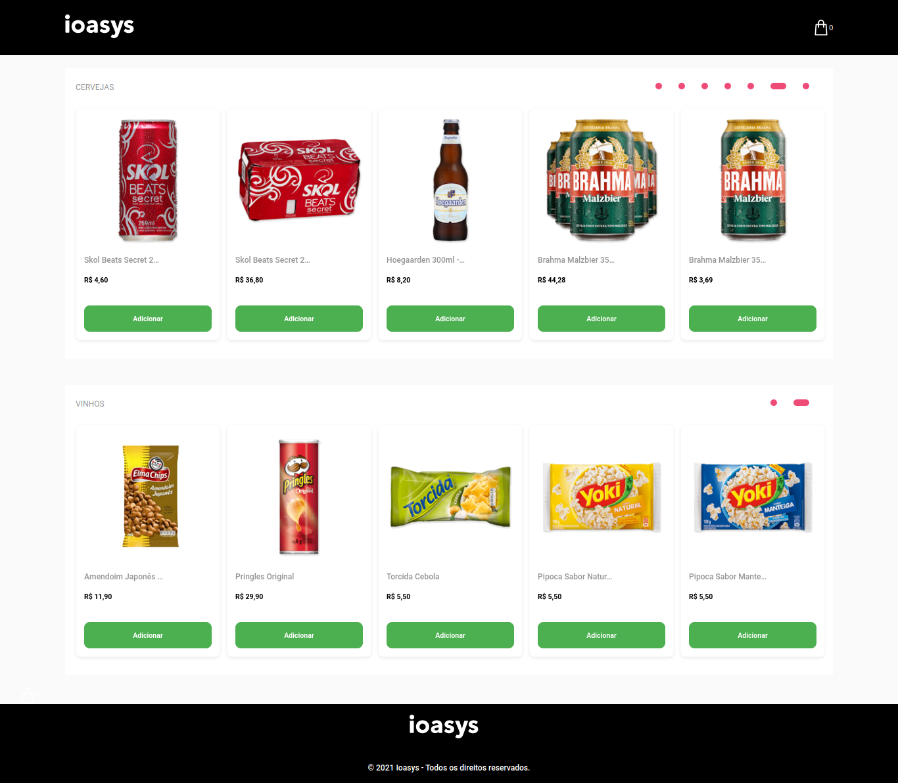

> ## Ioasys Store

<p align="center">

</p>


> ### Getting Started

```sh
# install dependencies
$ yarn

# run the project
$ yarn dev
```

> ### Commands

- `dev`: runs your application on `localhost:3000` and fake api on `localhost:3001`


> ### Built with

- Create React App
- Styled Components
- Polished
- JSON Server